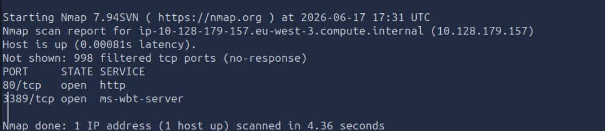
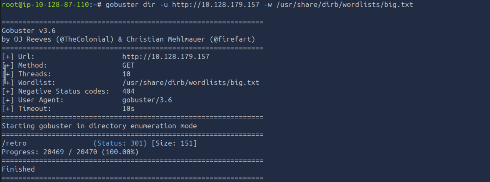
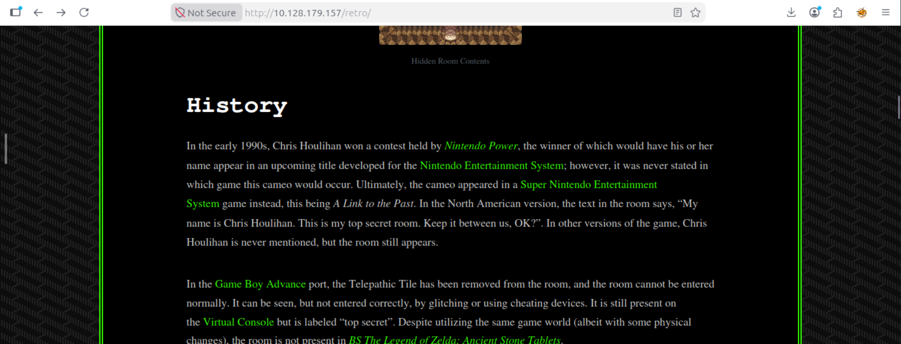
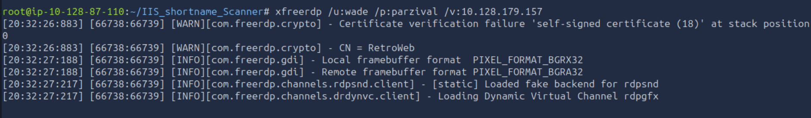
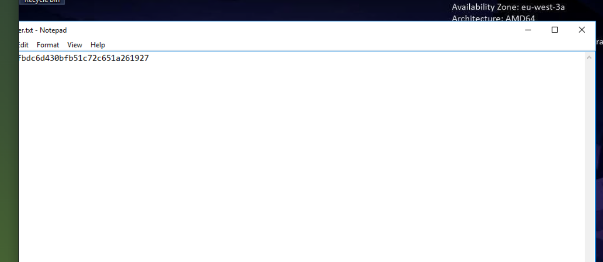
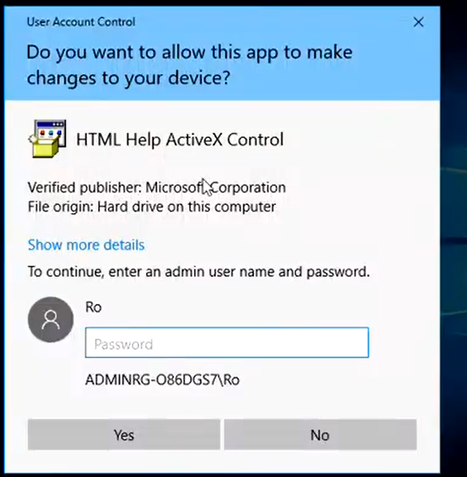

# TryHackMe: Retro - CTF Write-up
**Author:** Mehdi Haidi

##  Objective
The goal of this Capture The Flag (CTF) challenge is to compromise a Windows machine, gain initial access by enumerating a web application, and escalate privileges to `NT AUTHORITY\SYSTEM` by exploiting a known Windows vulnerability (CVE-2019-1388).

##  Tools Used
* **Nmap:** Network and port scanning
* **Gobuster:** Directory and file enumeration
* **xfreerdp:** Remote Desktop Protocol client
* **CVE-2019-1388:** Windows Certificate Dialog Privilege Escalation Exploit

---

## 1. Reconnaissance & Enumeration

### Port Scanning
To begin, I conducted a network scan using Nmap to identify open ports and running services on the target machine.

```bash
nmap -sV -sC 10.128.179.157
```



**Results:** The scan revealed two key open ports:
* **Port 80 (HTTP):** Microsoft IIS web server.
* **Port 3389 (RDP):** Remote Desktop Protocol.

### Web Enumeration
Navigating to the web server on Port 80 displayed a default IIS page. To find hidden directories, I utilized Gobuster with the `big.txt` wordlist.

```bash
gobuster dir -u [http://10.128.179.157](http://10.128.179.157) -w /usr/share/dirb/wordlists/big.txt
```



**Results:** Gobuster discovered a hidden directory at `/retro`.

Navigating to `/retro` revealed a WordPress blog themed around vintage gaming. By thoroughly exploring the posts and comments, I identified a potential user named **Wade**. In one of the posts, Wade drops a heavy hint regarding his password, referencing his favorite character from *Ready Player One* (**parzival**).



---

## 2. Initial Access

With a valid username (`wade`) and a suspected password (`parzival`), I attempted to log in to the machine remotely via RDP (Port 3389) utilizing `xfreerdp`.

```bash
xfreerdp /u:wade /p:parzival /v:10.128.179.157
```



The credentials were correct, granting me access to Wade's desktop environment. From here, I immediately navigated to the desktop and secured the first user flag.



---

## 3. Privilege Escalation (CVE-2019-1388)

Upon exploring the file system, I noticed an executable file on the desktop related to a Windows Certificate Dialog vulnerability. The objective was to escalate privileges from a standard user to Administrator/SYSTEM.

I successfully exploited **CVE-2019-1388 (Windows Certificate Dialog Privilege Escalation)** using the following attack path:

1. Executed the vulnerable binary (`hhupd.exe`) as an administrator, which triggered the User Account Control (UAC) prompt.
2. Clicked on **"Show more details"** and then **"Show information about the publisher's certificate"**.
3. Once the certificate window opened, I clicked on the **"Issued by"** hyperlink.



4. Because the UAC prompt was running with elevated permissions, clicking the link spawned a browser instance running with `NT AUTHORITY\SYSTEM` privileges.
5. From the browser window, I initiated a "Save As" dialogue, navigated to `C:\Windows\System32`, and executed `cmd.exe`.

This chain resulted in a command prompt running as SYSTEM, granting me full administrative control over the machine and allowing me to secure the final `root.txt` flag.

---

##  Lessons Learned
* **Information Disclosure:** Leaving potential passwords or hints on public-facing web applications or blogs provides an easy foothold for attackers.
* **Patch Management:** Outdated operating systems are vulnerable to well-documented exploits like CVE-2019-1388. Keeping systems patched is a critical defense against privilege escalation.
